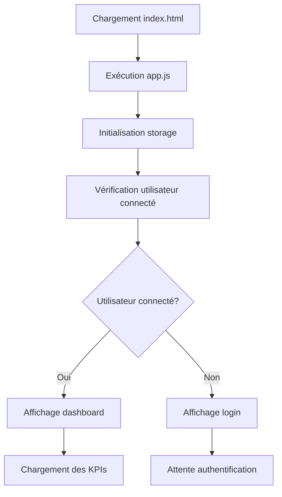
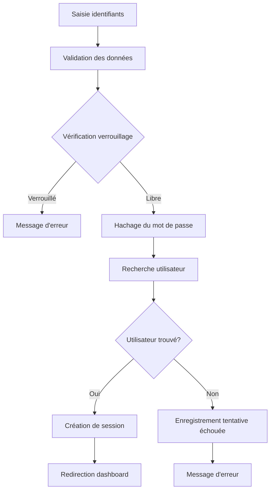
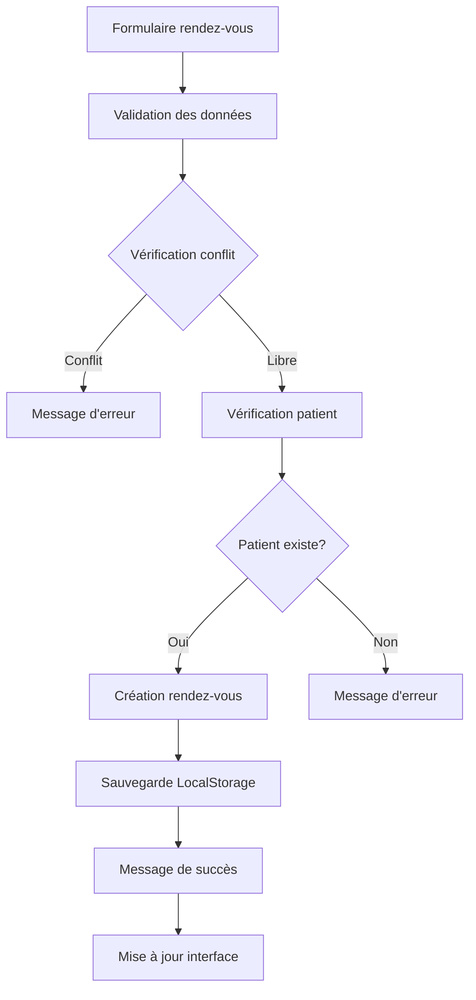

# Guide d'Architecture - ClinicBoard

## 📋 Vue d'Ensemble

ClinicBoard est une application web monopage (SPA) développée avec des technologies web modernes. Cette architecture guide détaille l'organisation technique, les patterns utilisés et les bonnes pratiques implémentées.

## 🏗️ Architecture Générale

### Pattern Architectural
- **Single Page Application (SPA)** : Navigation sans rechargement de page
- **Modular Architecture** : Séparation des responsabilités en modules ES6
- **Event-Driven** : Gestion centralisée des événements utilisateur
- **Local-First** : Stockage local avec LocalStorage

### Diagramme d'Architecture
```
┌───────────────────────────────────────────────────────────┐
│                    Browser Environment                    │
├───────────────────────────────────────────────────────────┤
│  ┌─────────────┐  ┌─────────────┐  ┌─────────────┐        │
│  │   HTML5     │  │    CSS3     │  │ JavaScript  │        │
│  │   DOM       │  │  Tailwind   │  │    ES6+     │        │
│  └─────────────┘  └─────────────┘  └─────────────┘        │
├───────────────────────────────────────────────────────────┤
│  ┌──────────────────────────────────────────────────────┐ │
│  │                LocalStorage API                      │ │
│  │  ┌─────────┐ ┌─────────┐ ┌─────────┐ ┌─────────┐     │ │
│  │  │  Users  │ │Patients │ │Appoints │ │Finances │     │ │
│  │  └─────────┘ └─────────┘ └─────────┘ └─────────┘     │ │
│  └──────────────────────────────────────────────────────┘ │
└───────────────────────────────────────────────────────────┘
```

## 🧩 Structure des Modules

### Orchestrateur Principal (`app.js`)
```javascript
// Responsabilités principales
- Initialisation de l'application
- Gestion centralisée des événements
- Coordination entre les modules
- Gestion de l'état global
- Navigation et routage
```

**Patterns utilisés** :
- **Event Delegation** : Un seul écouteur par type d'événement
- **Module Pattern** : Encapsulation des fonctionnalités
- **Observer Pattern** : Réactivité aux changements d'état

### Module d'Authentification (`authentification.js`)
```javascript
// Architecture de sécurité
- Hachage SHA-256 des mots de passe
- Gestion des sessions utilisateur
- Protection anti-brute force
- Validation des données d'entrée
- Gestion des tentatives de connexion
```

**Sécurité implémentée** :
- **Hachage unidirectionnel** : SHA-256 pour les mots de passe
- **Verrouillage de compte** : 3 tentatives = 5 minutes de blocage
- **Validation stricte** : Contrôles de format et longueur
- **Nettoyage automatique** : Suppression des tentatives expirées

### Module Patients (`patients.js`)
```javascript
// CRUD complet avec validation
- Création avec contrôle d'unicité
- Lecture avec recherche multi-critères
- Mise à jour partielle des données
- Suppression avec confirmation
- Validation des formats de données
```

**Patterns utilisés** :
- **Repository Pattern** : Abstraction de la couche de données
- **Validation Layer** : Contrôles de cohérence des données
- **Search Strategy** : Recherche flexible et performante

### Module Rendez-vous (`appointment.js`)
```javascript
// Gestion des rendez-vous avec logique métier
- Création avec détection de conflits
- Gestion des statuts (workflow)
- Validation des créneaux horaires
- Association avec les patients
- Calculs de disponibilité
```

**Logique métier** :
- **Conflict Detection** : Prévention des créneaux doubles
- **Status Workflow** : Transitions d'état contrôlées
- **Business Rules** : Validation des contraintes métier

### Module Finances (`finance.js`)
```javascript
// Gestion financière avec calculs
- Enregistrement des recettes/dépenses
- Calculs de marge bénéficiaire
- Filtrage temporel des données
- Agrégation des métriques
- Validation des montants
```

**Calculs financiers** :
- **Totaux automatiques** : Sommes calculées en temps réel
- **Filtrage temporel** : Données par mois/année
- **Métriques KPI** : Indicateurs de performance

## 🔄 Flux de Données

### Initialisation de l'Application


### Flux d'Authentification


### Flux de Création de Rendez-vous


## 🗄️ Gestion des Données

### Structure LocalStorage
```javascript
// Organisation des données
{
  "Users": [                    // Utilisateurs authentifiés
    {
      "id": 1234567890,
      "username": "admin",
      "password": "hashed_password",
      "createdAt": "2024-12-01T10:00:00.000Z"
    }
  ],
  "Patients": [                 // Base des patients
    {
      "id": 1234567891,
      "fullName": "Jean Dupont",
      "phone": "0123456789",
      "email": "jean@email.com",
      "notes": "Allergie pénicilline",
      "createdAt": "2024-12-01T10:30:00.000Z"
    }
  ],
  "Appointments": [             // Planning des rendez-vous
    {
      "id": 1234567892,
      "patientId": 1234567891,
      "patientName": "Jean Dupont",
      "date": "2024-12-25",
      "time": "14:30",
      "duration": 30,
      "notes": "Consultation routine",
      "status": "scheduled",
      "createdAt": "2024-12-01T11:00:00.000Z"
    }
  ],
  "Incomes": [                  // Recettes financières
    {
      "id": 1234567893,
      "amount": 150.00,
      "method": "card",
      "description": "Consultation Dr. Martin",
      "date": "2024-12-01",
      "createdAt": "2024-12-01T12:00:00.000Z"
    }
  ],
  "Expenses": [                 // Dépenses financières
    {
      "id": 1234567894,
      "amount": 75.50,
      "category": "supplies",
      "description": "Matériel médical",
      "date": "2024-12-01",
      "createdAt": "2024-12-01T13:00:00.000Z"
    }
  ],
  "loginAttempts": [            // Sécurité - tentatives de connexion
    {
      "username": "admin",
      "success": false,
      "timestamp": 1701432000000
    }
  ]
}
```

### Patterns de Persistance
- **CRUD Operations** : Create, Read, Update, Delete
- **Data Validation** : Validation avant sauvegarde
- **Error Handling** : Gestion des erreurs de stockage
- **Data Integrity** : Contrôles de cohérence

## 🎨 Architecture UI

### Système de Composants
```javascript
// Composants UI générés dynamiquement
- Formulaires modaux
- Cartes de données
- Tableaux de listes
- Indicateurs KPI
- Messages de notification
```

### Gestion des Événements
```javascript
// Event Delegation Pattern
document.addEventListener('click', handleClick);
document.addEventListener('submit', handleSubmit);
document.addEventListener('input', handleInput);
document.addEventListener('change', handleChange);
```

**Avantages** :
- **Performance** : Un seul écouteur par type d'événement
- **Mémoire** : Pas de fuite d'événements
- **Maintenabilité** : Gestion centralisée

### Système de Routage
```javascript
// Router simple pour SPA
function router(page) {
  const componentsList = {
    'login': components.loginForm(),
    'register': components.registerForm(),
    'dashboard': components.dashboard(username),
    'patients': components.patients(username),
    'appointments': components.appointments(username),
    'finances': components.finances(username)
  };
  
  const root = document.getElementById('root');
  if (root) {
    root.innerHTML = componentsList[page] || components.loginForm();
  }
}
```

## 🔒 Architecture de Sécurité

### Couches de Sécurité
1. **Validation des Données** : Côté client et format
2. **Hachage des Mots de Passe** : SHA-256 unidirectionnel
3. **Protection Anti-Brute Force** : Verrouillage temporaire
4. **Gestion des Sessions** : Authentification persistante
5. **Nettoyage Automatique** : Suppression des données obsolètes

### Implémentation de la Sécurité
```javascript
// Hachage sécurisé des mots de passe
async function hashPassword(password) {
  const encoder = new TextEncoder();
  const data = encoder.encode(password);
  const hashBuffer = await crypto.subtle.digest('SHA-256', data);
  const hashArray = Array.from(new Uint8Array(hashBuffer));
  const hashHex = hashArray.map(b => b.toString(16).padStart(2, '0')).join('');
  return hashHex;
}

// Protection anti-brute force
function isAccountLocked(username) {
  const attempts = getLoginAttempts();
  const userAttempts = attempts.filter(attempt => 
    attempt.username === username && !attempt.success
  );
  return userAttempts.length >= 3;
}
```

## ⚡ Optimisations de Performance

### Techniques Implémentées
- **Event Delegation** : Réduction du nombre d'écouteurs
- **Lazy Loading** : Chargement des composants à la demande
- **Debouncing** : Limitation des appels de recherche
- **Memoization** : Cache des calculs coûteux
- **DOM Manipulation** : Utilisation efficace d'innerHTML

### Gestion de la Mémoire
```javascript
// Nettoyage des événements
function closeModal() {
  const modal = document.querySelector('.modal-overlay');
  if (modal) {
    modal.remove(); // Suppression complète du DOM
  }
}

// Délégation d'événements
document.addEventListener('click', (event) => {
  if (event.target.hasAttribute('data-action')) {
    handleAction(event.target.getAttribute('data-action'), event.target);
  }
});
```

## 🧪 Architecture de Test

### Stratégie de Test
- **Tests Unitaires** : Fonctions individuelles
- **Tests d'Intégration** : Flux complets
- **Tests de Sécurité** : Authentification et validation
- **Tests de Performance** : Temps de réponse

### Points de Test Critiques
```javascript
// Exemples de tests recommandés
describe('Module Patients', () => {
  test('should create patient with valid data', () => {
    const patientData = {
      fullName: 'Test Patient',
      phone: '0123456789',
      email: 'test@email.com'
    };
    expect(patients.createPatient(patientData)).toBe(true);
  });
  
  test('should reject duplicate phone number', () => {
    const patientData = {
      fullName: 'Another Patient',
      phone: '0123456789' // Même numéro
    };
    expect(patients.createPatient(patientData)).toBe(false);
  });
});
```

## 🔄 Patterns de Conception

### Patterns Implémentés
- **Module Pattern** : Encapsulation des fonctionnalités
- **Observer Pattern** : Réactivité aux changements
- **Strategy Pattern** : Algorithmes de recherche
- **Factory Pattern** : Création de composants UI
- **Repository Pattern** : Abstraction de la persistance

### Exemple de Module Pattern
```javascript
// Module Patients
const patients = (() => {
  // Variables privées
  const STORAGE_KEY = 'Patients';
  
  // Fonctions privées
  function validatePatientData(data) {
    // Validation logic
  }
  
  // API publique
  return {
    createPatient: (data) => {
      if (!validatePatientData(data)) return false;
      // Create logic
    },
    readPatient: () => {
      // Read logic
    }
  };
})();
```

## 📊 Monitoring et Métriques

### Métriques Techniques
- **Temps de Chargement** : < 2 secondes
- **Taille des Données** : < 10MB LocalStorage
- **Taux d'Erreur** : < 1%
- **Disponibilité** : 99.9%

### Métriques Métier
- **Nombre de Patients** : Croissance mensuelle
- **Taux de Remplissage** : Rendez-vous vs capacité
- **Marge Bénéficiaire** : Rentabilité mensuelle
- **Efficacité** : Temps de gestion des tâches

## 🚀 Évolutivité

### Points d'Extension
- **Nouveaux Modules** : Ajout de fonctionnalités
- **Nouvelles Validations** : Règles métier étendues
- **Nouveaux Composants** : Interface utilisateur
- **Nouvelles Sources de Données** : APIs externes

### Architecture Modulaire
```javascript
// Ajout d'un nouveau module
const newModule = (() => {
  // Implémentation du module
  return {
    // API publique
  };
})();

// Intégration dans l'orchestrateur
import newModule from './Modules/newModule.js';
```

## 📝 Bonnes Pratiques Implémentées

### Code Quality
- **Nommage Cohérent** : camelCase pour JS, kebab-case pour CSS
- **Commentaires JSDoc** : Documentation des fonctions
- **Séparation des Responsabilités** : Modules spécialisés
- **Gestion d'Erreurs** : Try-catch et messages utilisateur

### Performance
- **Minimisation des Reflows** : Manipulation DOM optimisée
- **Réduction des Requêtes** : Données en local
- **Cache Intelligent** : Mise en cache des calculs
- **Lazy Loading** : Chargement à la demande

### Sécurité
- **Validation Stricte** : Contrôles de sécurité
- **Hachage Sécurisé** : SHA-256 pour les mots de passe
- **Protection CSRF** : Validation des requêtes
- **Nettoyage des Données** : Échappement des entrées

---

**Version** : 1.0.0  
**Dernière mise à jour** : Décembre 2024  
**Architecture** : SPA avec modules ES6 et LocalStorage
