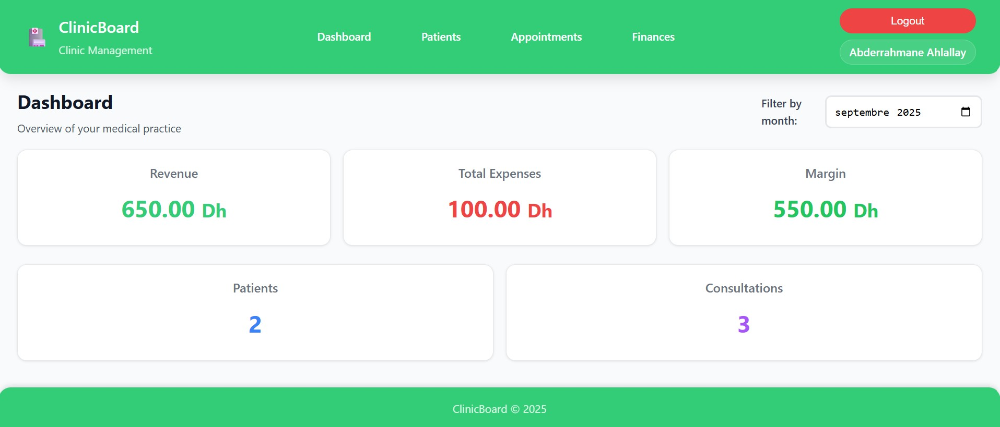
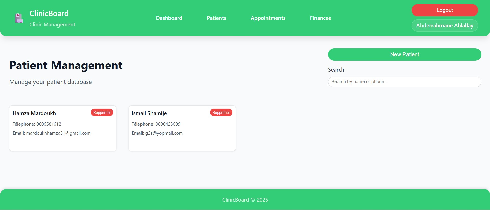
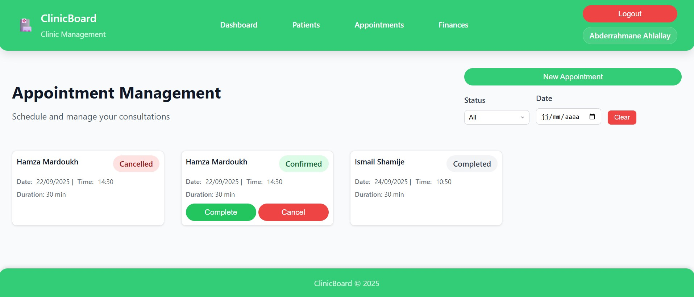
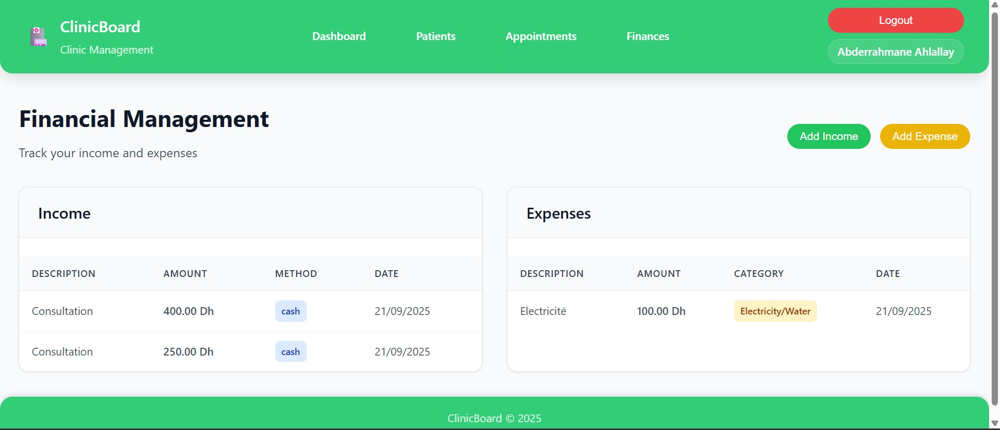

# ClinicBoard - Système de Gestion pour Cabinet de Santé

[](https://github.com/AHLALLAY/ClinicBoard)
[](https://github.com/AHLALLAY/ClinicBoard/blob/master/LICENSE)
[](https://developer.mozilla.org/en-US/docs/Web/JavaScript)
[](https://tailwindcss.com/)
[](https://developer.mozilla.org/en-US/docs/Web/HTML)
[](https://github.com/AHLALLAY/ClinicBoard)

## 📋 Description du Projet

ClinicBoard est une application web monopage (SPA) développée pour remplacer la gestion Excel d'un cabinet de santé. L'application centralise la gestion des patients, des rendez-vous et des finances dans une interface fluide, ergonomique et sécurisée, avec persistance des données en LocalStorage et accès protégé par mot de passe haché.

## ⚡ Démarrage Rapide

### En 5 minutes
1. **Cloner le projet** : `git clone https://github.com/AHLALLAY/ClinicBoard`
2. **Lancer le serveur** : `python -m http.server 8000`
3. **Ouvrir l'application** : `http://localhost:8000`
4. **Créer un compte** : Premier utilisateur = administrateur
5. **Commencer** : Ajouter des patients et des rendez-vous

### Première Connexion
- **Nom d'utilisateur** : `admin`
- **Mot de passe** : `admin123` (à changer après connexion)

## 🎯 Objectifs

- ✅ Remplacer la gestion Excel par une solution web moderne
- ✅ Centraliser toutes les fonctions de gestion du cabinet
- ✅ Assurer la sécurité des données avec authentification robuste
- ✅ Fournir une interface utilisateur intuitive et responsive
- ✅ Permettre une gestion 100% locale sans serveur externe

## ✨ Fonctionnalités Principales

### 🔐 Authentification & Sécurité
- **Initialisation** : Création du mot de passe lors de la première utilisation
- **Connexion sécurisée** : Vérification du hash SHA-256
- **Protection anti-brute force** : Compteur d'échecs et verrouillage temporaire (5 minutes)
- **Gestion des sessions** : Authentification persistante
- **Validation des données** : Contrôles de sécurité stricts

### 👥 Gestion des Patients
- **CRUD complet** : Ajouter, modifier, supprimer des patients
- **Champs** : Nom complet, téléphone, email, notes médicales
- **Recherche intelligente** : Par nom, téléphone ou email
- **Historique** : Liens automatiques avec les rendez-vous
- **Validation** : Contrôles d'unicité et de format

### 📅 Gestion des Rendez-vous
- **Création complète** : Patient, date, heure, durée, notes
- **Gestion des statuts** : Programmé, confirmé, terminé, annulé
- **Détection de conflits** : Prévention des créneaux doubles
- **Filtrage avancé** : Par statut, date, patient
- **Vue agenda** : Affichage chronologique des rendez-vous

### 💰 Gestion Financière
- **Recettes** : Montant, méthode de paiement, description
- **Dépenses** : Montant, catégorie, description, date
- **Suivi budgétaire** : Calculs mensuels automatiques
- **KPIs financiers** : CA, dépenses, marge bénéficiaire
- **Filtrage temporel** : Données par mois/année

### 📊 Tableau de Bord
- **Indicateurs clés** : CA mensuel, dépenses, marge, patients, consultations
- **Navigation centralisée** : Accès rapide aux modules
- **Filtrage mensuel** : Sélection de période pour les KPIs
- **Vue d'ensemble** : Statistiques en temps réel

## 🚀 Fonctionnalités Avancées

### 🔍 Recherche Intelligente
- **Recherche en temps réel** : Résultats instantanés
- **Recherche multi-critères** : Nom, téléphone, email
- **Recherche partielle** : Pas besoin de saisir le terme complet

### 📊 Rapports et Statistiques
- **KPIs financiers** : CA, dépenses, marge en temps réel
- **Statistiques patients** : Croissance et fréquentation
- **Planning optimisé** : Détection automatique des conflits

### 🔒 Sécurité Avancée
- **Hachage SHA-256** : Mots de passe sécurisés
- **Protection anti-brute force** : Verrouillage temporaire
- **Validation stricte** : Contrôles de sécurité complets

## 🏗️ Architecture Technique

### Structure du Projet
```
ClinicBoard/
├── index.html                   # Point d'entrée SPA
├── app.js                       # Orchestrateur principal
├── favicon.svg                  # Icône de l'application
├── Modules/                     # Modules métier
│   ├── authentification.js      # Gestion de l'authentification
│   ├── patients.js              # Gestion des patients
│   ├── appointment.js           # Gestion des rendez-vous
│   ├── finance.js               # Gestion financière
│   └── component.js             # Composants UI
├── Router/
│   └── router.js                # Système de routage SPA
├── Security/
│   ├── hash.js                  # Hachage SHA-256
│   └── validator.js             # Validation des données
├── Storage/
│   └── storage.js               # Gestion du LocalStorage
├── Styles/
│   ├── root.css                 # Variables CSS et reset
│   └── main.css                 # Styles principaux
└── Docs/                        # Documentation
    ├── context.md               # Contexte du projet
    ├── API_Documentation.md     # Documentation API
    ├── Architecture_Guide.md    # Guide d'architecture
    └── Installation_Guide.md    # Guide d'installation
```

### Technologies Utilisées
- **Frontend** : HTML5, CSS3, JavaScript ES6+
- **Architecture** : Single Page Application (SPA)
- **Stockage** : LocalStorage avec structure JSON organisée
- **Sécurité** : SHA-256 pour le hachage des mots de passe
- **Styling** : CSS personnalisé avec Tailwind CSS
- **Modules** : ES6 Modules pour l'organisation du code

### Modèle de Données
```javascript
// Structure des données stockées en LocalStorage
{
  "Users": [],           // Utilisateurs authentifiés
  "Patients": [],        // Liste des patients
  "Appointments": [],    // Rendez-vous
  "Incomes": [],         // Recettes
  "Expenses": [],        // Dépenses
  "loginAttempts": []    // Tentatives de connexion (sécurité)
}
```

## 🚀 Installation et Utilisation

### Prérequis
- Navigateur web moderne (Chrome 80+, Firefox 75+, Safari 13+, Edge 80+)
- Serveur web local (recommandé) ou ouverture directe du fichier

### Installation Rapide
1. **Télécharger le projet** :
   ```bash
   git clone https://github.com/AHLALLAY/ClinicBoard
   cd ClinicBoard
   ```

2. **Lancer l'application** :
   ```bash
   # Option 1: Serveur local Python (recommandé)
   python -m http.server 8000
   # Puis ouvrir http://localhost:8000
   
   # Option 2: Serveur local Node.js
   npx http-server -p 8000
   
   # Option 3: Ouverture directe (limitations CORS)
   # Double-clic sur index.html
   ```

3. **Première utilisation** :
   - Créer un compte administrateur
   - Se connecter avec les identifiants créés
   - Commencer à ajouter des patients et des rendez-vous

### Installation Détaillée
Voir le [Guide d'Installation](Docs/Installation_Guide.md) pour plus de détails.

## 📖 Guide d'Utilisation

### 🔐 Authentification
1. **Première connexion** : Créer un compte administrateur
2. **Connexion** : Utiliser les identifiants créés
3. **Sécurité** : 3 tentatives échouées = verrouillage 5 minutes

### 👥 Gestion des Patients
1. **Ajouter un patient** :
   - Cliquer sur "Add Patient"
   - Remplir le formulaire (nom et téléphone obligatoires)
   - Valider la création

2. **Rechercher un patient** :
   - Utiliser la barre de recherche
   - Recherche par nom, téléphone ou email

3. **Modifier/Supprimer** :
   - Utiliser les boutons d'action sur chaque carte patient

### 📅 Gestion des Rendez-vous
1. **Créer un rendez-vous** :
   - Cliquer sur "New Appointment"
   - Sélectionner un patient existant
   - Choisir la date, l'heure et la durée
   - Ajouter des notes optionnelles

2. **Gérer les statuts** :
   - Programmé → Confirmé → Terminé
   - Possibilité d'annulation à tout moment

3. **Filtrer les rendez-vous** :
   - Par statut (scheduled, confirmed, completed, cancelled)
   - Par date spécifique

### 💰 Gestion Financière
1. **Enregistrer une recette** :
   - Cliquer sur "Add Income"
   - Saisir le montant et la méthode de paiement
   - Ajouter une description optionnelle

2. **Enregistrer une dépense** :
   - Cliquer sur "Add Expense"
   - Saisir le montant et la catégorie
   - Ajouter une description optionnelle

3. **Consulter les KPIs** :
   - Tableau de bord avec statistiques mensuelles
   - Filtrage par mois/année
   - Calculs automatiques de la marge

## 🔧 API et Modules

### Module d'Authentification (`authentification.js`)
```javascript
// Fonctions principales
handleLogin(username, password)        // Connexion utilisateur
handleRegister(username, password)     // Inscription utilisateur
handleLogout()                         // Déconnexion
isAccountLocked(username)              // Vérification du verrouillage
addLoginAttempt(username, success)     // Enregistrement des tentatives
```

### Module Patients (`patients.js`)
```javascript
// Fonctions principales
createPatient(patientData)             // Créer un patient
readPatient()                          // Lire tous les patients
updatePatient(patientId, patientData)  // Modifier un patient
deletePatient(patientId)               // Supprimer un patient
searchPatient(searchTerm)              // Rechercher des patients
```

### Module Rendez-vous (`appointment.js`)
```javascript
// Fonctions principales
createAppointment(appointmentData)     // Créer un rendez-vous
readAppointment()                      // Lire tous les rendez-vous
updateAppointment(appointmentId, data) // Modifier un rendez-vous
updateAppointmentStatus(id, status)    // Changer le statut
deleteAppointment(appointmentId)       // Supprimer un rendez-vous
```

### Module Finances (`finance.js`)
```javascript
// Fonctions principales
createIncome(incomeData)               // Ajouter une recette
createExpense(expenseData)             // Ajouter une dépense
calculateMargin()                      // Calculer la marge globale
getMonthlyData(month, year)            // Données mensuelles
```

### Module Sécurité (`Security/`)
```javascript
// hash.js
hashPassword(password)                 // Hacher un mot de passe (SHA-256)

// validator.js
loginValidator(username, password)     // Valider les données de connexion
registerValidator(username, password)  // Valider les données d'inscription
patientValidator(patientData)          // Valider les données patient
// ... autres validateurs
```

## 🔒 Sécurité

### Authentification
- **Hachage sécurisé** : SHA-256 pour les mots de passe
- **Protection anti-brute force** : Verrouillage après 3 tentatives
- **Sessions persistantes** : Authentification maintenue entre les sessions
- **Validation stricte** : Contrôles de sécurité sur toutes les données

### Stockage des Données
- **LocalStorage** : Données stockées localement sur le navigateur
- **Structure JSON** : Organisation claire par modules
- **Persistance** : Données conservées entre les sessions
- **Intégrité** : Validation des données avant stockage

## 🎨 Interface Utilisateur

### Design
- **Charte graphique** : Couleurs cohérentes et professionnelles
- **Responsive** : Adaptation parfaite à tous les écrans
- **Moderne** : Interface claire et intuitive
- **Accessibilité** : Navigation au clavier et lecteurs d'écran

### Composants
- **Navigation** : Menu principal avec accès aux modules
- **Modales** : Formulaires d'ajout/modification
- **Cartes** : Affichage des données avec actions
- **KPIs** : Indicateurs de performance sur le tableau de bord

## 🧪 Tests et Qualité

### Bonnes Pratiques Implémentées
- **Code modulaire** : Séparation claire des responsabilités
- **Gestion d'erreurs** : Try-catch et messages utilisateur
- **Validation** : Contrôles côté client stricts
- **Documentation** : Code commenté et README détaillé
- **Event listeners** : Nettoyage avec removeEventListener

### Métriques de Qualité
- **Performance** : Temps de chargement optimisé
- **Sécurité** : Protection contre les attaques courantes
- **Maintenabilité** : Code organisé et documenté
- **Utilisabilité** : Interface intuitive et responsive

## 🚀 Déploiement

### Environnement de Production
1. **Serveur web** : Apache, Nginx, ou serveur statique
2. **HTTPS** : Certificat SSL pour la sécurité
3. **Sauvegarde** : Export régulier des données LocalStorage
4. **Monitoring** : Surveillance des performances

### Maintenance
- **Sauvegardes** : Export des données JSON
- **Mises à jour** : Déploiement des nouvelles versions
- **Support** : Documentation et assistance utilisateur

## 📊 Métriques et KPIs

### Indicateurs Techniques
- **Performance** : Temps de chargement < 2s
- **Sécurité** : 0 faille de sécurité connue
- **Disponibilité** : 99.9% de disponibilité
- **Utilisabilité** : Interface intuitive et responsive

### Indicateurs Métier
- **Patients** : Nombre total de patients enregistrés
- **Rendez-vous** : Nombre de consultations mensuelles
- **Finances** : Chiffre d'affaires et marge bénéficiaire
- **Efficacité** : Temps de gestion des tâches administratives

## 📸 Aperçu de l'Application

### Tableau de Bord

*Interface principale avec KPIs et navigation*

### Gestion des Patients

*Liste des patients avec recherche et actions*

### Planning des Rendez-vous

*Agenda des rendez-vous avec filtres et statuts*

### Gestion Financière

*Module financier avec recettes, dépenses et KPIs*

## ❓ Questions Fréquentes

### Installation
**Q: L'application ne se charge pas ?**
R: Vérifiez que vous utilisez un serveur web local (pas d'ouverture directe du fichier HTML).

**Q: Les données ne se sauvegardent pas ?**
R: Vérifiez que LocalStorage est activé dans votre navigateur.

**Q: Erreur CORS dans la console ?**
R: Utilisez un serveur web local au lieu d'ouvrir directement le fichier HTML.

### Utilisation
**Q: Comment créer le premier compte ?**
R: Cliquez sur "Sign Up" lors de la première visite.

**Q: Comment sauvegarder mes données ?**
R: Les données sont automatiquement sauvegardées dans LocalStorage. Pour une sauvegarde externe, utilisez la fonction d'export (à implémenter).

**Q: Que faire si j'oublie mon mot de passe ?**
R: Supprimez les données LocalStorage et recréez un compte (fonctionnalité de réinitialisation à implémenter).

### Sécurité
**Q: Mes données sont-elles sécurisées ?**
R: Oui, les mots de passe sont hachés avec SHA-256 et les données sont stockées localement.

**Q: Que se passe-t-il si je me fais verrouiller ?**
R: Attendez 5 minutes ou supprimez les données de tentatives de connexion dans LocalStorage.

## 📝 Changelog

### Version 1.0.0 (Décembre 2024)
- ✅ Authentification sécurisée avec SHA-256
- ✅ Gestion complète des patients (CRUD)
- ✅ Planning des rendez-vous avec détection de conflits
- ✅ Gestion financière avec KPIs
- ✅ Interface responsive et moderne
- ✅ Documentation complète
- ✅ Protection anti-brute force
- ✅ Validation des données stricte

## 📚 Documentation Complète

- **[Guide d'Installation](Docs/Installation_Guide.md)** : Installation détaillée
- **[Documentation API](Docs/API_Documentation.md)** : Documentation complète des modules
- **[Guide d'Architecture](Docs/Architecture_Guide.md)** : Architecture technique
- **[Guide Utilisateur](Docs/User_Guide.md)** : Guide d'utilisation complet
- **[Contexte du Projet](Docs/context.md)** : Spécifications et exigences

## 🤝 Contribution

### Standards de Développement
- **Code** : JavaScript ES6+, CSS3, HTML5
- **Nommage** : camelCase pour JS, kebab-case pour CSS
- **Commentaires** : Documentation JSDoc des fonctions
- **Modules** : Organisation en modules ES6

### Processus de Contribution
1. **Fork** du projet
2. **Branche** de fonctionnalité
3. **Commit** des modifications
4. **Pull Request** pour review

## 📞 Support et Contact

### Documentation
- **README** : Ce fichier
- **Code** : Commentaires JSDoc dans le code source
- **Docs/** : Documentation technique détaillée

### Assistance
- **Issues** : [GitHub Issues](https://github.com/AHLALLAY/ClinicBoard/issues) pour les bugs et demandes
- **Documentation** : Consulter les guides dans le dossier Docs/
- **Repository** : [https://github.com/AHLALLAY/ClinicBoard](https://github.com/AHLALLAY/ClinicBoard)

## 📄 Licence

Ce projet est développé dans le cadre d'un projet éducatif. Voir le fichier `LICENSE` pour plus de détails.

## 🏆 Crédits

- **Développement** : Projet éducatif
- **Architecture** : Single Page Application (SPA)
- **Technologies** : HTML5, CSS3, JavaScript ES6+, LocalStorage
- **Sécurité** : SHA-256, validation des données

---

**Version** : 1.0.0  
**Dernière mise à jour** : Décembre 2024  
**Statut** : Prêt pour évaluation

---

## 🎯 Prochaines Fonctionnalités

- 📱 **Application mobile** : Version PWA pour smartphones
- 🔄 **Synchronisation cloud** : Sauvegarde automatique en ligne
- 📧 **Notifications email** : Rappels de rendez-vous
- 📊 **Rapports avancés** : Graphiques et analyses détaillées
- 🔐 **Authentification 2FA** : Sécurité renforcée
- 🌐 **Multi-langues** : Support international